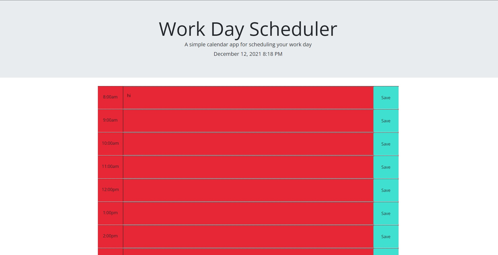

# Work Day Scheduler

The is a work day scheduler that uses a mixture of html, css, jquery, bootstrap, and moment js. 

The following picture is what the scheduler looks like as a launched application.

The time blocks are styled with bootstrap in the html files with a little bit of css for things like the border, making the textera none resizable, and making it transparent. 

In the Javascript file you will see a mixture of jquery and moment js. This is were the month, day, year, and the time comes from at the top. It is formated using the "LLL" method for moment. It is then appended using jquery by targeting the currentDay id and changing the text to be the variable we set for "LLL". 

We then put moment through a loop function via jquery and see if the time block is equal, greater than, or less than the current time which dictates the class it receives changing its color value. 

Then the information put into the textera is saved to local storage using the ave button and then maintained even after refreshing the page by setting the value that matches the ID in local storage.